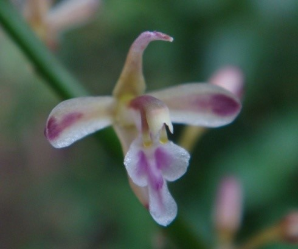

# *Acriopsis liliifolia* (Koen.) Omerod

## Scientific classification

|               |                                       |
| ------------- | ------------------------------------- |
| Kingdom       | Plantae                               |
| (unranked)    | Angiosperms                           |
| (unranked)    | Monocots                              |
| Order         | Asparagales                           |
| Family        | Orchidaceae                           |
| Subfamily     | Epidendroideae                        |
| Tribe         | Cymbidieae                            |
| Subtribe      | Cymbidiinae                           |
| Genus         | Acriopsis                             |
| Species       | A. liliifolia                         |
| Binomial name | *Acriopsis liliifolia* (Koen.) Omerod |

---

Anggrek epifit, sympodial . Pseudobulb bulat, tumbuh bergerombol atau saling berdekatan antara satu sama lain dengan akar keputihan menjepit kuat terlihat di antaranya. Daun-daun muncul dari pseudobulb berjumlah 2-4 helai ,berbentuk pita memanjang, berukuran sampai dengan 28 x 2 cm, dengan panjang tangkai daun + 2cm. Karangan bunga berbentuk seperti malai, panjang sampai dengan 60cm dengan banyak cabang yang mendukung +50 kuntum bunga (bahkan sampai dengan 200 kuntum), sekitar setengahnya dapat mekar pada tiap waktu. Bunga berukuran kecil, berdiameter 1,2 mm; tepal berwarna kuning pucat dengan sebuah garis violet yang meluas merata di bagian tengahnya, bibir memiliki keping sisi yang sama lebar dan panjang, bergerigi pinggirnya,  keping tengah lebih sempit, ujungnya melengkung agak dalam, dengan dua keeping (*lamellae*)  atau tulang rusuk yang muncul dari pusatnya.

### Penyebaran
Lazim di seluruh Jawa walaupun agak berkurang di bagian timur, pada ketinggian 1.000 m di atas permukaan laut (dpl), sering tumbuh pada pohon yang dibudidayakan atau liar. Spesies tersebut dapat berdiri pada tingkat yang lebih tinggi dibanding kebanyakan epifit. Tersebar luas di Asia Tenggara, New Guinea dan Australia.

> ***Catatan:***  
> Berbunga sekitar bulan Januari, Juni s/d Agustus

---

