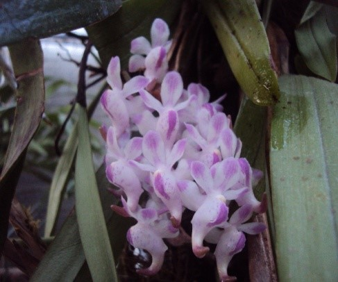
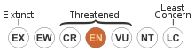

# *Aerides odoratus* Lour

## Conservation status

## Scientific classification

|               |                         |
| ------------- | ----------------------- |
| Kingdom       | Plantae                 |
| (unranked)    | Angiosperms             |
| (unranked)    | Monocots                |
| Order         | Asparagales             |
| Family        | Orchidaceae             |
| Subfamily     | Epidendroideae          |
| Genus         | Aerides                 |
| Species       | A. odorata              |
| Binomial name | *Aerides odoratus* Lour |

---

Anggrek epifit, monopodial. Batang, panjang mencapai 70 cm, mendatar atau tangkainya terletak di dasar, ujungnya naik ke atas. Secara perawakan mirip *Vanda tricolor*. Daun terpisah 2,5 cm pada kedua sisi batang, terletak pada dua baris, saling melilit, keras dan tebal, panjang ± 20 cm, lebar 2,75 cm dengan ujung yang menumpul dan terbelah dua, berjumlah ± 7 helai.  Karangan Bunga muncul dari ketiak daun, panjang tandan 32 cm yang mendukung 24 kuntum bunga. Bunga mengeluarkan aroma harum sehingga diberi nama *odorata*. Warna bunga putih bertitik-titik ungu, di setiap sudut perhiasan bunga ada noktah berwarna ungu muda; bibir berbelah tiga dan menyatu menutupi tugunya, sedangkan *spur*-nya melengkung ke depan seperti kuku dengan ujung yang runcing, sehingga dijuluki anggrek kuku macan.

### Penyebaran
Umumnya banyak tumbuh di dataran rendah di bawah ketinggia 500 m dpl.

> ***Catatan:***  
> Berbunga sekitar bulan September
