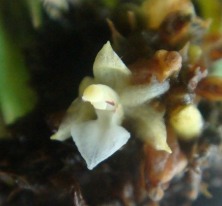

# *Agrostophyllum laxum* J.J.Sm

## Scientific classification

|               |                               |
| ------------- | ----------------------------- |
| Kingdom       | Plantae                       |
| (unranked)    | Angiosperms                   |
| (unranked)    | Monocots                      |
| Order         | Asparagales                   |
| Family        | Orchidaceae                   |
| Subfamily     | Epidendroideae                |
| Tribe         | Epidendreae                   |
| Subtribe      | Glomerinae                    |
| Genus         | Agrostophyllum Blume, 1825    |
| Species       | A. laxum                      |
| Binomial name | *Agrostophyllum laxum* J.J.Sm |

---

Anggrek epifit, sympodial. Batang panjang sampai 80cm dan lebar 1,5cm. Daun, pada setengah ketinggian batang lebih luas (33 x 3,5 cm) dibanding yang di dekat dasar (4 cm x 5mm), semua dengan ujung tumpul. Karangan bunga, *capitulum* berdiameter sekitar 4 cm di ujung batang, terdiri dari 4-6 kuntum bunga berduri. Bunga, putih kekuningan, lebar + 1 cm; sepal, panjang 5-6 mm; tepal, meruncing; bibir *trilobed* dengan keping sisi tumpul pendek, keping tengah bersegi tiga dan meruncing dari suatu dasar yang sempit; ujungnya melintang di atas lipatan tersebut memiliki bagian tepi ungu.

### Penyebaran
Lazim di Jawa Barat dan Jawa Tengah tetapi  sejauh ini tidak ditemukan di Jawa Timur, dari 700-1,100 m dpl, di hutan. Ditemukan juga di Sumatra.

> ***Catatan:***  
> Berbunga sekitar bulan Juni-Juli

---

